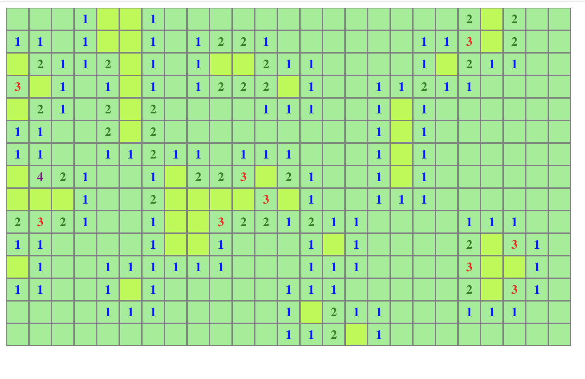

# MineSweeper
## Run

* npm install 
* npm start
* go to localhost:3000

## Adjust field size and rate of mines
Change line 137 : 

```
let mineField = new MineField(15,25,0.1);
//arg 1: row
//arg 2: col
//arg 3: mine rate
```
## Limitations
Cannot mark mine locations.


